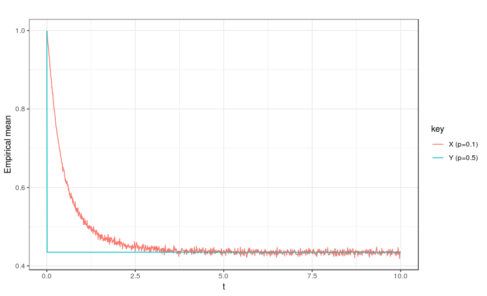

<style type="text/css">

h1.title {
  font-size: 28px;
  color: DarkRed;
  text-align: center;
}
h4.author { /* Header 4 - and the author and data headers use this too  */
    font-size: 18px;
  font-family: "Times New Roman", Times, serif;
  color: Black;
  text-align: center;
}
h4.date { /* Header 4 - and the author and data headers use this too  */
  font-size: 16px;
  font-family: "Times New Roman", Times, serif;
  color: Black;
  text-align: center;
}
</style>
<div id="htmlwidget-4092" style="width:75%; height:75%; 
position:absolute" class="leaflet html-widget"></div>


```{r,echo=FALSE,comment = NA,error=FALSE ,warning=FALSE,message=FALSE,eval=TRUE}
rm(list = ls())
knitr::opts_chunk$set(
  echo = TRUE,     # don't show code
  comment = NA,
  error=FALSE ,
  warning = FALSE,  # don't show warnings
  message = FALSE,  # don't show messages (less serious warnings)
  cache = FALSE,    # set to TRUE to save results from last compilation
  fig.align = "center",# center figures
  fig.pos='h'
)

## libraries
library(MASS)
library(dplyr)
library(tidyr)
library(ggplot2)
library(Peacock.test)

```

# Introduction

Given a stochastic differential equation (SDE) with oblique reflection :

\begin{equation}
dX(t)= g(X(t))dt + \sigma(X(t))dW(t) + r(X(t))d\ell(t)
\end{equation}
with $\ell(t)$ is a continuous nondecreasing process with $\ell(0) = 0$  which can increase only when it inside it domain and reflected back inside its domain in the direction of r(z) as X hits the domain at a point z. Once the process is in it domain, $X(t)$ behaves as a solution to the SDE below.

\begin{equation}
dX(t) = g(X(t)) dt + \sigma(X(t)) dW(t).
\end{equation}

We implement the numerical approximation of solutions of stochastic differential equations driven by brownian motion which are moving inside a domain and obliquely reflected at the boundary as follows:

\begin{equation}
z_{k+1}-z_k=[g(z_k) + \varphi(d(z_k))\times r(y(zk))]\epsilon +\sigma(z_k)\epsilon_{k+1};
\end{equation}

where $\epsilon_1, \epsilon_2,... \sim N(0; \epsilon I_d)$. We define this function $Z_\epsilon$ as piecewise constant: $Z_\epsilon (t) := Z_\epsilon (k\epsilon) = z_k, t \in [k\epsilon; (k + 1)\epsilon), k = 0, 1,...$


# Half-line


##  Obliquely reflected brownian motion with  penalty term
We simulate a brownian motion with a penalty term for half-line.

$$ z(t+\epsilon)\approx z(t) +[\varphi(d(z(t)))\times r(y(z(t)))]\epsilon + \varepsilon_{t+\epsilon}, $$

where $Z(0)=1, \quad \varepsilon_{t+\epsilon}\sim \mathcal{N}(0,\epsilon), \epsilon=0.01$,  time horizon $t=1, a=100,p=0.1 $ and 
$$\varphi(d(z(t)))\times r(y(z(t)))=\textit{ penalty term with reflection}=\begin{cases}
0, \quad if \quad z(t)\geq 0\\
a[z(t)]^p, if \quad z(t)< 0
\end{cases}$$

```{r ,fig.width=5,fig.height=3,fig.cap="Obliquely reflected brownian motion with  penalty"}

SDE_RF <- function(begin, end,step=0.01,drift=0,sigma=1,a=100,p=0.1,r=1, X0=0){
   t<-seq(begin,end,step) ### create sequence 
   n=length(t)
   dt  <- step
   dw<-rnorm(n, 0, sqrt(step))
   X<-NULL
   X[1] <- X0
   ## penalty function
   penalty<- function(a,p,r,x){
     ifelse(x>=0,0,r*a*((abs(x))^p))
   }
   if(is.function(drift) & is.function(sigma)){
   ## drift
   d<- as.function(alist(x=,drift))
   drift<-d(1)
   ## sigma
   sig<- as.function(alist(x=,sigma))
   sigma<-sig(1)
   for (i in 2:n) {
     X[i] <-  X[i-1]+ drift(X[i-1])*dt + penalty(a,p,r,X[i-1])*dt + sigma(X[i-1])*dw[i]
     }
   }
   else if(is.function(drift) & !is.function(sigma)){
       ## drift
       d<- as.function(alist(x=,drift))
       drift<-d(1)
       for (i in 2:n) {
       X[i] <-  X[i-1]+ drift(X[i-1])*dt + penalty(a,p,r,X[i-1])*dt + sigma*dw[i]
     }
     }
   else if(!is.function(drift) & is.function(sigma)){
       ## sigma
       sig<- as.function(alist(x=,sigma))
       sigma<-sig(1)
       for (i in 2:n) {
        X[i] <-  X[i-1]+ drift*dt + penalty(a,p,r,X[i-1])*dt + sigma(X[i-1])*dw[i]
       }
    } else {
        for (i in 2:n) {
        X[i] <-  X[i-1]+ drift*dt + penalty(a,p,r,X[i-1])*dt + sigma*dw[i]
       }
      }
   return(data.frame(t,X));
 }
 
 ## Example
 drift<-function(x){-1} 
 sigma1<-function(x){1}
 X1<-SDE_RF(0,1,step = 0.001,drift = drift, sigma = sigma1,
            a=100,p=0.1,r=1,X0=1)
X1%>%gather(key,value, X) %>%
    ggplot(aes(x=t, y=value)) +
    geom_line() +theme_bw()+
  ggtitle("") +
  xlab("t") + ylab("Z")

```


##  Convergence on half-line
A reflected brownian motion for unit negative drift has a stationary distribution, which is exponential with mean $\dfrac{1}{2}$, which serves as a limiting distribution for a long-time limit. See figure (1) below for $a=100$

{width=70%}

\newpage
## Obliquely reflected Ornstein-Uhlenbeck process with  penalty term

$$ 
dX(t)=3(2-X(t))dt +2dW(t)
$$

```{r ,fig.width=5,fig.height=3}
## Example
 drift<-function(x){3*(2-x)} 
 sigma1<-function(x){2}
 X1<-SDE_RF(0,1,step = 0.001,drift = drift, sigma = sigma1,
            a=100,p=0.1,r=1,X0=1)
X1%>%gather(key,value, X) %>%
    ggplot(aes(x=t, y=value)) +
    geom_line() +theme_bw()+
  ggtitle("") +
  xlab("t") + ylab("Z")

```


# Two-dimensional SDE 


```{r ,eval=FALSE,fig.width=6,fig.height=4}
SDE_2D <- function(Begin, End,Step,X0){
  mu <- c(0,0) # Mean 
  sigma <- matrix(c(Step, 0, 0, Step),2)
  t<-seq(Begin,End,Step) ### create sequence 
  n=length(t)
  dt  <- Step
  X<- matrix(NA, nrow = n, ncol = 2)
  X[1,] <- X0
  for (i in 2:n) {
    drf1<-(t(c(1,-1,1))%*%matrix(c(X[(i-1), ],1)))*dt
    drf2<- ((t(c(-2,-1))%*%matrix(X[(i-1), ])))*dt
    Wt<- c(2*X[(i-1),1]-3,4)* mvrnorm(1, mu = mu, Sigma = sigma )
    X[i,]  <- c(X[(i-1), ]) + c(drf1,drf2) + Wt
  }
  X<-data.frame(X)
  colnames(X)<-c("X1t","X2t")
  return(data.frame(t,X))
}
X6<-SDE_2D(0,2,Step = 0.001,X0=c(1,-3))
X6%>% gather(key,value, X1t, X2t) %>%
    ggplot(aes(x=t, y=value, colour=key)) +
    geom_line() +theme_bw()+
  ggtitle("SDE") +
  xlab("t") + ylab("Value")
ggplot(data = X6, aes(x=X1t, y=X2t)) +
    geom_point() +theme_bw()+
  ggtitle("SDE in 2-D") +
  xlab("X1(t)") + ylab("X2(t)")

```


#  Comparing 2-D SDE processes using Peacok test

```{r ,eval=FALSE,fig.width=6,fig.height=4}
peacock_p_value<-NULL
K<-100
for (i in 1:K) {
  Yt7<-SDE_2D(0,2,Step = 0.001,X0=c(1,-3))
  Yt8<-SDE_2D(0,4,Step = 0.002,X0=c(1,-3))
  peacock_p_value[i]<-peacock2(Yt8[,2:3],Yt7[,2:3])
}

plot(peacock_p_value,type="o", xlab="iteration",ylab="p-value",
     main="Plot of KS p-values")
points(rep(0.05,K),type = "l", col="red")


```


<!---
# R Code

```{r ref.label = knitr::all_labels(), echo = TRUE, eval = FALSE}
# this R markdown chunk generates a code appendix
```
--->

